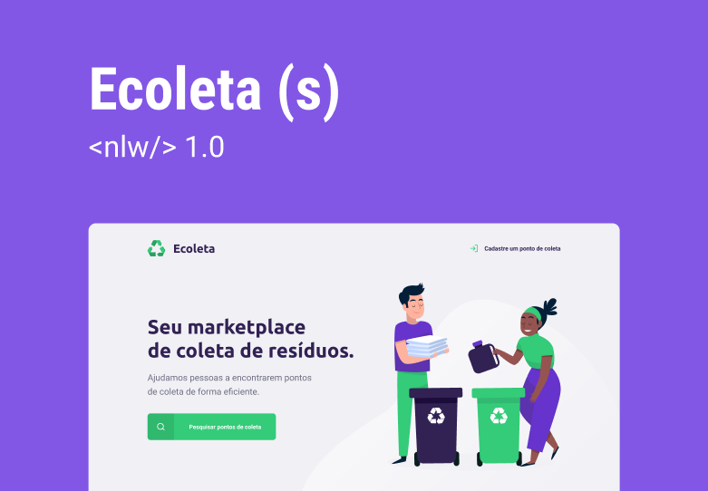

<h1 align="center">
    
</h1>

 <a href="#descricao">Descrição</a> •
 <a href="#layout">Layout</a> • 
 <a href="#tecnologias">Tecnologias</a> • 
 <a href="#status">Status</a> • 

<h2 id="descricao">  Projeto </h2>

  O <strong>Ecoleta</strong> é um marketplace que ajuda pessoas a encontrarem pontos de coleta de resíduos de forma eficiente.
 Essa aplicação web desenvolvida durante a <strong>nlw-01</strong> da <strong>rocketseat</strong>. Visando ser a trilha mais simples, o starter traz consigo a experiência prática dos conceitos mais simples porém com aplicação bem completa dentro do desenvolvimento web. 

 

<h2 id="layout">  Layout </h2>

 
<a href="https://www.figma.com/file/Byw4X5etg8VCmezueyhzkC/Ecoleta-(Starter)?node-id=136%3A546">Acesse o layout no <strong>figma<strong></a>

## 🚀 Tecnologias

Esse projeto foi desenvolvido com as seguintes tecnologias:

- [Node.js](https://nodejs.org/en/)
- [Express](https://expressjs.com/pt-br/)
- [SQLite](https://www.sqlite.org/index.html)
- [Nunjucks](https://mozilla.github.io/nunjucks/)

 
